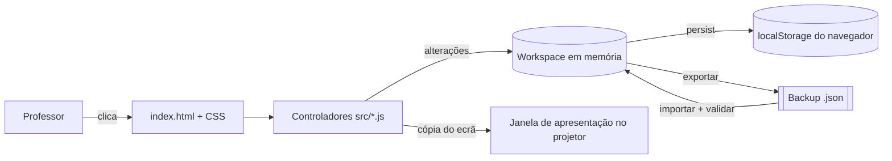
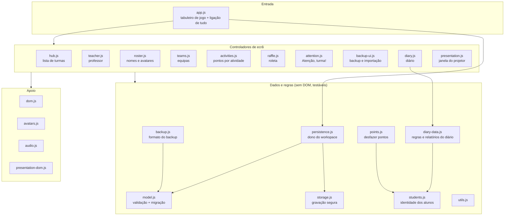
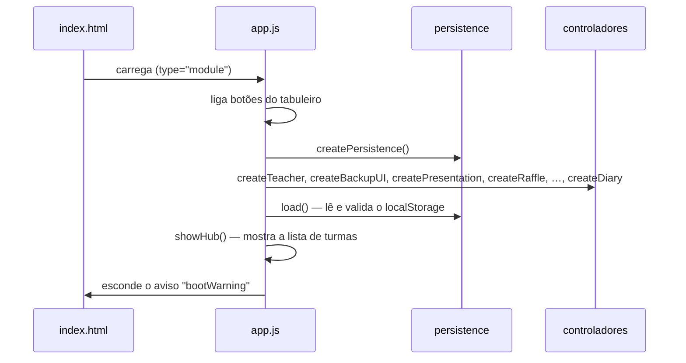
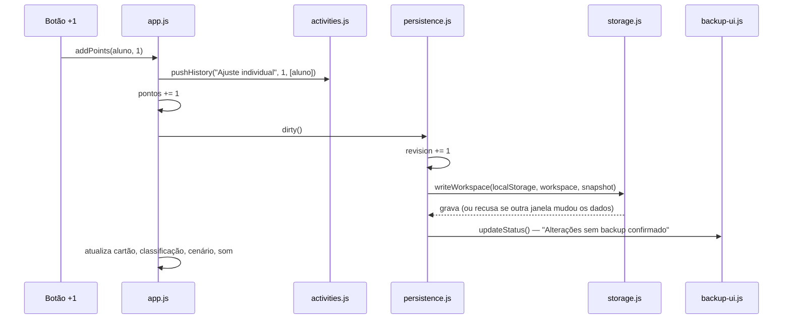

# Guia completo do projeto

Este guia explica o TIC Quest de ponta a ponta: o que é, como está organizado, como os dados circulam, o que mudou em cada versão e como fazer as alterações mais comuns. Pode ser lido por ordem ou consultado por secção.

- [1. Visão geral em 2 minutos](#1-visão-geral-em-2-minutos)
- [2. Mapa dos ficheiros](#2-mapa-dos-ficheiros)
- [3. Como o código está organizado](#3-como-o-código-está-organizado)
- [4. Os dados](#4-os-dados)
- [5. O que acontece quando…](#5-o-que-acontece-quando)
- [6. Versões](#6-versões)
- [7. Testes](#7-testes)
- [8. Receitas de manutenção](#8-receitas-de-manutenção)
- [9. Glossário](#9-glossário)

Documentos relacionados: [README](../README.md) (uso e comandos), [arquitetura](ARQUITETURA.md) (regras técnicas resumidas), [revisão técnica](REVISAO.md) (limites conhecidos) e [segurança](../SECURITY.md).

---

## 1. Visão geral em 2 minutos

**O que é:** um site estático (HTML, CSS e JavaScript) que o navegador executa sozinho. Não há servidor de dados, contas nem base de dados: tudo fica no `localStorage` do navegador e é levado para outro lado através de **backups JSON**.

**Sem framework:** o JavaScript é "puro" (módulos ES nativos). O Node.js só é usado no computador de quem desenvolve, para testes, formatação e o servidor local, e nunca no site publicado.

**Três ideias que explicam quase tudo:**

1. **Um "workspace" guarda tudo:** professor, turmas, atividades frequentes. É um único objeto JSON gravado numa chave do `localStorage`.
2. **Cada ecrã tem um "controlador":** um ficheiro `createX(app)` que liga os botões desse ecrã e guarda o seu estado temporário.
3. **Os dados de fora nunca entram sem validação:** tudo o que vem do `localStorage` ou de um backup passa por `model.js`, que verifica, corrige formatos antigos e rejeita o que é inválido.



---

## 2. Mapa dos ficheiros

### Raiz

| Ficheiro / pasta                       | Para que serve                                                               |
| -------------------------------------- | ---------------------------------------------------------------------------- |
| `index.html`                           | Todo o HTML da aplicação (ecrãs e janelas). Carrega os CSS e `src/app.js`.   |
| `src/`                                 | JavaScript da aplicação (ver abaixo).                                        |
| `assets/css/`                          | Estilos, divididos por área.                                                 |
| `assets/images/`                       | Cenário e folhas de sprites (WebP).                                          |
| `tests/`                               | Testes automáticos.                                                          |
| `tools/`                               | `serve.js` (servidor local) e `build.js` (prepara `dist/` para publicar).    |
| `docs/`                                | Esta documentação.                                                           |
| `.github/workflows/`                   | `check.yml` verifica cada push; `pages.yml` publica (manual).                |
| `package.json`, `package-lock.json`    | Comandos `npm` e versões exatas das ferramentas de desenvolvimento.          |
| `eslint.config.js`, `.prettierrc.json` | Regras de qualidade (ESLint) e de formatação (Prettier).                     |
| `.editorconfig`, `.gitattributes`      | Fins de linha e indentação consistentes.                                     |
| `.gitignore`                           | Exclui `node_modules/`, `dist/` e nomes típicos de backups (dados pessoais). |
| `.claude/launch.json`                  | Configuração do servidor local para o Claude Code (opcional).                |
| `LICENSE`, `SECURITY.md`, `README.md`  | Licença, segurança/privacidade e apresentação do projeto.                    |

### `src/` — JavaScript

Os ficheiros dividem-se em três camadas. Setas = "usa".



| Ficheiro              | Linhas | Responsabilidade                                                                                                                       |
| --------------------- | -----: | -------------------------------------------------------------------------------------------------------------------------------------- |
| `app.js`              |   ~750 | Ponto de entrada. Turma aberta, cartões dos alunos, classificação, aluno selecionado, pontos, vidas, overlays. Cria os outros módulos. |
| `diary.js`            |   ~840 | Ecrã do diário: calendário, aulas, presenças, TPC, notas privadas, histórico por dia, rascunho do dia.                                 |
| `diary-data.js`       |   ~210 | Regras do diário sem ecrã: criar aula, quem pode receber pontos de TPC, textos dos relatórios.                                         |
| `model.js`            |   ~390 | Valida e normaliza dados; converte formatos antigos; define `VERSION` (11).                                                            |
| `backup-ui.js`        |   ~320 | Janelas de backup e importação; avisos de gravação.                                                                                    |
| `raffle.js`           |   ~300 | Roleta de sorteio (desenho em `<canvas>`, animação, vencedor).                                                                         |
| `presentation.js`     |   ~180 | Abre a segunda janela e copia para lá só o jogo, sem dados privados.                                                                   |
| `hub.js`              |   ~170 | Lista de turmas: criar, duplicar, arquivar, exportar.                                                                                  |
| `audio.js`            |   ~150 | Sons gerados pelo navegador (Web Audio), sem ficheiros de som.                                                                         |
| `avatars.js`          |   ~150 | Escolha e desenho dos avatares (sprites).                                                                                              |
| `activities.js`       |   ~145 | "Atribuir pontos" a vários alunos; regista o histórico.                                                                                |
| `roster.js`           |   ~130 | Janela "Equipa de jogadores" (nomes e avatares de todos).                                                                              |
| `persistence.js`      |   ~105 | Dono do workspace: carregar, gravar, recuperar, restaurar.                                                                             |
| `teacher.js`          |   ~100 | Nome, título e personagem do professor.                                                                                                |
| `attention.js`        |    ~95 | Contagem "Atenção, turma!" de 10 segundos.                                                                                             |
| `teams.js`            |    ~85 | Sorteio de equipas e pontos por equipa.                                                                                                |
| `backup.js`           |    ~70 | Empacota e verifica backups (checksum).                                                                                                |
| `students.js`         |    ~60 | Identidade dos alunos: criar, corrigir nome, remover, "é o mesmo aluno?".                                                              |
| `dom.js`              |    ~55 | Atalhos de DOM (`$`, `element`, `button`) e downloads.                                                                                 |
| `utils.js`            |    ~55 | Datas, identificadores, cópias, validações pequenas.                                                                                   |
| `presentation-dom.js` |    ~30 | Atualiza a janela de apresentação sem reiniciar animações.                                                                             |
| `storage.js`          |    ~20 | Grava no `localStorage` só se ninguém mudou os dados entretanto.                                                                       |
| `points.js`           |    ~15 | Regra para desfazer um lançamento de pontos.                                                                                           |

### `assets/css/` — estilos

A **ordem** em que o `index.html` carrega os ficheiros importa: quando duas regras têm a mesma força, vence a que vem depois.

| Ordem | Ficheiro           | Área                                                                 |
| ----: | ------------------ | -------------------------------------------------------------------- |
|     1 | `styles.css`       | Base: cores (variáveis em `:root`), botões, layout geral.            |
|     2 | `feedback.css`     | Animações e janelas de feedback (vencedor, vidas, pontos a flutuar). |
|     3 | `game.css`         | Ecrã de jogo: cenário, cartões, roleta, avatares.                    |
|     4 | `workspace.css`    | Lista de turmas, backup, importação, professor.                      |
|     5 | `diary.css`        | Diário.                                                              |
|     — | `presentation.css` | Só na janela de apresentação (acrescentado por `presentation.js`).   |

---

## 3. Como o código está organizado

### O padrão "controlador"

Cada ecrã é uma função `createX(app)` num ficheiro próprio. Exemplo simplificado (`teams.js`):

```js
export function createTeams(app) {
  const { $, dirty, playSound, openOverlay, activeSlots } = app; // dependências explícitas

  function render() {
    /* desenha as equipas de app.state */
  }

  $("teamsOpen").onclick = () => {
    render();
    openOverlay("teamsOverlay", "teamCount");
  };
  $("makeTeams").onclick = () => {
    /* sorteia, chama dirty() e render() */
  };

  return { render }; // só o que os outros módulos precisam
}
```

Regras deste padrão:

- **Recebe tudo o que usa** no parâmetro `app`, nunca por variáveis globais.
- **Liga apenas os seus botões.** Cada elemento do HTML tem um único "dono".
- **Devolve só o necessário:** `teams.render()`, `raffle.cancel()`, `activities.pushHistory()`…

### O objeto `live` (em `app.js`)

Alguns valores **são substituídos** enquanto a aplicação corre: ao abrir outra turma, `state` passa a ser outro objeto; ao restaurar um backup, o workspace inteiro é trocado. Se um controlador guardasse uma cópia, ficaria a mexer no objeto antigo. Por isso os controladores leem esses valores através de _getters_:

```js
const live = {
  get state() {
    return state;
  }, // turma aberta
  get cards() {
    return cards;
  }, // cartões dos alunos
  get workspace() {
    return persistence.workspace;
  },
  get storageOK() {
    return persistence.storageOK;
  },
};
```

`withLive({...})` junta as dependências de cada controlador com estes getters. Dentro do controlador usa-se `app.state`, `app.workspace` — sempre o valor atual.

### Ordem de arranque

No fim de `app.js`, os módulos são criados por ordem de dependência e só depois os dados são lidos:



Se o JavaScript falhar, o aviso `bootWarning` do HTML continua visível. É uma forma simples de perceber que algo correu mal.

---

## 4. Os dados

### Onde ficam

| Chave no `localStorage`           | Conteúdo                                                                                 |
| --------------------------------- | ---------------------------------------------------------------------------------------- |
| `tic-quest.workspace.v8`          | O workspace atual (JSON). O "v8" no nome é histórico e não mudou, para não perder dados. |
| `tic-quest.workspace.v8.previous` | A versão anterior, guardada a cada gravação, para recuperação.                           |

### Estrutura (versão 11)

```text
workspace
├── format: "tic-quest-workspace"
├── version: 11
├── revision: 42                    ← sobe 1 a cada alteração
├── lastBackup: { date, revision }  ← último backup confirmado
├── teachers: [ { id, name, title, avatar } ]
├── activeTeacherId
├── activeClassId
├── presets: [ { name: "TPC entregue", points: 1 } ]   ← atividades frequentes
└── classes: [
      {
        id, className: "7.º B", lives: 0–5, archived: false,
        students: [ 30 posições, sempre ]
          { id: "q-…" | null, name, points, inPool, gender, avatar, avatarMode }
        groups: [ { members: [posições], points } ]       ← equipas (até 6)
        history: [                                        ← lançamentos de pontos
          { id, title, date, points,
            recipients: [ { slot, studentId, name } ],
            undoneAt: null | data }
        ]
        diary: {
          lessons: [ { id, date, number, teacher, summary, activities,
                       homework, due,
                       attendance: [ { slot, studentId, name, status,
                                       note, delivery, awardId } ] } ],
          notes:   [ { id, date, text, slot | null, studentId, name } ]
        }
      }
    ]
```

Pontos importantes:

- **30 posições fixas por turma.** Uma posição vazia tem `name: ""` e `id: null`. A posição nunca desaparece, para que os registos antigos (que guardam `slot`) continuem a apontar para o sítio certo.
- **Aluno = posição + `id`.** Desde a versão 11, cada aluno com nome tem um `id`. Corrigir o nome mantém o `id`; remover o aluno apaga-o. Ver [identidade](ARQUITETURA.md#identidade-dos-alunos-versão-11).
- **Registos guardam o nome da altura.** Mesmo que o aluno seja renomeado ou removido, o histórico e o diário mostram o nome que tinha quando o registo foi feito.
- **TPC premiado:** a linha da presença guarda `awardId`, o `id` do lançamento no histórico. A validação exige que essa ligação exista.
- **Nível ("fase"):** não é guardado. É calculado: `fase = floor(pontos / 20) + 1`.

### Limites (validados em `model.js`)

| Limite                           | Valor  |
| -------------------------------- | ------ |
| Alunos por turma                 | 30     |
| Equipas por turma                | 6      |
| Vidas                            | 0–5    |
| Turmas                           | 200    |
| Atividades frequentes            | 200    |
| Perfis de professor              | 100    |
| Lançamentos no histórico / turma | 10 000 |
| Aulas no diário / turma          | 2 000  |
| Notas / turma                    | 10 000 |
| Tamanho de um backup importado   | 20 MB  |
| Pontos por atividade             | 1–1000 |

### O ficheiro de backup

```json
{
  "format": "tic-quest-backup",
  "version": 11,
  "exportedAt": "2026-09-24T10:00:00.000Z",
  "scope": "all",
  "checksum": "a1b2c3d4",
  "payload": { "...": "o workspace inteiro" }
}
```

O `checksum` é uma impressão digital do `payload`. Se alguém editar o ficheiro à mão ou ele ficar cortado a meio, a importação recusa-o ("a verificação de integridade falhou"). `scope` é `"all"` (backup completo) ou `"class"` (uma turma exportada).

A importação aceita três formatos: este backup, um workspace "cru" (o JSON do `localStorage`) e um save antigo de uma só turma (versões 1–6).

---

## 5. O que acontece quando…

### …o professor dá +1 ponto a um aluno



### …os dados são gravados

`persistence.dirty()` é chamado depois de qualquer alteração. Antes de gravar, `storage.js` compara o que está no `localStorage` com o que foi lido da última vez:

- **Igual:** grava e guarda a versão anterior em `.previous`.
- **Diferente** (outra janela alterou os dados): **não grava**. A aplicação mostra um aviso e os dados continuam em memória, prontos para exportar. Assim, duas janelas abertas nunca apagam o trabalho uma da outra.
- **Quota cheia ou armazenamento bloqueado:** aviso visível, "Gravação local suspensa".

### …a aplicação abre com dados estragados

`persistence.load()` tenta ler o workspace. Se não conseguir, tenta a cópia `.previous`. Se nenhuma servir, começa vazio **sem gravar por cima**, para que os dados originais possam ainda ser recuperados. Em qualquer destes casos aparece um aviso a pedir para exportar ou restaurar um backup.

### …se faz um backup

"Backup completo" descarrega o ficheiro e pede confirmação de que ficou guardado. Só depois da confirmação é que `lastBackup` é atualizado e o aviso "Alterações sem backup confirmado" desaparece. Fechar a página com alterações sem backup mostra o aviso do navegador.

### …se importa um backup

1. O ficheiro é lido e validado **antes** de mexer em qualquer coisa: tamanho, formato, checksum e todas as regras de `model.js`, incluindo a conversão de versões antigas.
2. É mostrado um resumo (quantas turmas, alunos, aulas).
3. **Importar como novas turmas:** junta às atuais, com novos IDs de turma.
4. **Restaurar (substituir):** pede confirmação, descarrega primeiro um backup do que existe (`TIC_ANTES_DE_RESTAURAR_…json`) e só depois substitui.

### …se abre a apresentação

`presentation.js` abre uma janela vazia, copia para lá os estilos e, a cada 120 ms, **uma cópia do ecrã de jogo**:

- Remove formulários, campos, o diário e botões de gestão.
- Só funcionam na janela do projetor os botões de uma lista fixa (`projectionAllowed`): sortear, pontos, vidas, silêncio… O clique é reencaminhado para o botão verdadeiro na janela principal.
- Nunca recebe o workspace nem o diário. As notas privadas não chegam ao projetor.
- Durante a roleta, o temporizador da animação corre na janela de apresentação, para continuar a girar mesmo com a janela principal minimizada.

### …se remove um aluno (versão 11)

"Remover aluno da turma" (ou apagar o nome) pede confirmação, zera a posição (`id: null`, nome vazio, pontos 0) e tira o aluno das equipas. O histórico e o diário **mantêm** os registos antigos com o nome da altura, mas esses lançamentos deixam de poder ser desfeitos ou premiados, porque a posição já não tem aquele aluno.

---

## 6. Versões

Há duas coisas diferentes a que chamamos "versão": a **versão do formato dos dados** (o número `version` dentro do JSON) e a **evolução do código** (commits).

### 6.1 Formato dos dados

O HTML original não está no repositório, por isso a tabela descreve apenas o que o código atual **reconhece e trata de forma diferente**.

| Versão | Tipo de ficheiro          | Aceite hoje?      | O que a distingue (segundo o código atual)                                                                                                          |
| ------ | ------------------------- | ----------------- | --------------------------------------------------------------------------------------------------------------------------------------------------- |
| 1      | Save de uma turma         | Sim, convertida   | Equipas guardavam os IDs dos alunos (`memberIds`) em vez das posições.                                                                              |
| 2–6    | Save de uma turma         | Sim, convertida   | Equipas por posição (`members`). O código trata 2–6 da mesma forma. Todas passam a turma dentro de um workspace novo.                               |
| 7      | —                         | Não               | Não é reconhecida pelo código (não há nenhuma conversão para ela).                                                                                  |
| 8      | Workspace (várias turmas) | Sim, convertida   | Primeiro formato com várias turmas. Sem perfis de professor (são ignorados ao importar).                                                            |
| 9–10   | Workspace / backup        | Sim, convertida   | Com perfis de professor. O código trata 9 e 10 da mesma forma. Alunos sem `id`; registos sem `studentId`.                                           |
| **11** | Workspace / backup        | **Formato atual** | Cada aluno com nome tem `id`; histórico, presenças e notas guardam `studentId`. Corrigir um nome mantém o aluno; "Remover aluno" liberta a posição. |

**O que acontece a dados antigos ao abrir a versão 11:**

| Dado antigo                                                                  | Depois da conversão                                                                  |
| ---------------------------------------------------------------------------- | ------------------------------------------------------------------------------------ |
| Aluno com nome, sem `id`                                                     | Recebe um `id` novo.                                                                 |
| Posição vazia                                                                | `id: null`.                                                                          |
| Lançamento/presença/nota cujo nome **ainda coincide** com o aluno da posição | Fica ligado a esse aluno (`studentId` = `id` dele).                                  |
| Registo cujo nome **já não coincide**                                        | `studentId: null`; continua a comparar pelo nome, como antes (não se pode desfazer). |
| Nota geral da turma (sem aluno)                                              | `studentId: null`.                                                                   |

**Compatibilidade entre versões da aplicação:**

| Situação                                             | Resultado                                                                |
| ---------------------------------------------------- | ------------------------------------------------------------------------ |
| Aplicação nova abre dados/backups 1–6, 8, 9, 10, 11  | Funciona; converte para 11.                                              |
| Aplicação antiga (até 10) abre um backup 11          | **Recusa** ("Versão não suportada"). Não há perda de dados, só não abre. |
| Dados no `localStorage` depois de usar a versão nova | Passam a estar em formato 11 na próxima gravação.                        |

### 6.2 Evolução do código

| Commit    | Data       | O que mudou                                                                                                                                   |
| --------- | ---------- | --------------------------------------------------------------------------------------------------------------------------------------------- |
| `866e104` | 2026-09-23 | Repositório criado (só README e licença MIT).                                                                                                 |
| `d4fd294` | 2026-09-23 | O HTML único (~11,4 MB, com imagens e código embutidos) é dividido em `index.html`, módulos JS, CSS e imagens. Testes, lint, CI e publicação. |
| `c434813` | 2026-09-23 | O nome do professor passa a ser indicado por quem usa (fim dos perfis de demonstração).                                                       |
| `a9f0709` | 2026-09-23 | Licença própria de uso pessoal/estudo não comercial.                                                                                          |
| `f87b2e9` | 2026-09-24 | Refatoração: `app.js` dividido em módulos, sintaxe moderna, imagens WebP, README reescrito, mais testes.                                      |
| `3634800` | 2026-09-24 | "Nova aula" retirado da janela de apresentação.                                                                                               |
| `632bbc1` | 2026-09-24 | Texto legal do README simplificado.                                                                                                           |
| `7df3d1d` | 2026-09-24 | Formato 11 (IDs de aluno, "Remover aluno"), avatar sorteado conforme o nome, `diary-data.js`, limpeza de CSS.                                 |

### 6.3 Antes e depois da revisão (resumo)

| Aspeto                | Antes (`d4fd294`)                                                  | Agora (`7df3d1d`)                                                                                         |
| --------------------- | ------------------------------------------------------------------ | --------------------------------------------------------------------------------------------------------- |
| `app.js`              | ~2 200 linhas com quase tudo                                       | ~750 linhas (tabuleiro + ligação); o resto em 12 módulos novos                                            |
| Estilo de JavaScript  | `var`, `function () {}`, dois estilos de eventos                   | `const`/`let`, arrow functions; o ESLint impede o estilo antigo                                           |
| Imagens               | PNG, ~8,2 MB                                                       | WebP, ~2 MB, mesma resolução                                                                              |
| CSS                   | ~2 920 linhas, 42 `!important`, regras de ecrãs que já não existem | ~2 590 linhas, 24 `!important`; estilo computado idêntico em 26 estados × 9 larguras                      |
| Diário                | Regras e relatórios misturados com o ecrã                          | Regras e relatórios em `diary-data.js`, testados sem ecrã                                                 |
| Identidade dos alunos | Posição + nome: corrigir um nome bloqueava desfazer e TPC          | `id` por aluno; corrigir mantém tudo; "Remover aluno" explícito                                           |
| Avatar automático     | 28% robô para todos; restantes pelo nome, se estivesse na lista    | 28% robô para todos; restantes pelo nome (listas + terminação -a/-o) ou sorteio se o nome não indica nada |
| Código morto          | Histórico de atividades duplicado, títulos alterados por JS        | Removido; cada botão tem um único dono                                                                    |
| Testes                | 11                                                                 | 33                                                                                                        |
| Documentação          | README técnico                                                     | README para professores + arquitetura + revisão + este guia                                               |

---

## 7. Testes

`npm test` corre todos; `npm run check` também verifica formatação e lint (é o que o GitHub corre a cada push). Os testes usam apenas dados fictícios.

| Ficheiro                    | O que garante                                                                                                                    |
| --------------------------- | -------------------------------------------------------------------------------------------------------------------------------- |
| `tests/model.test.js`       | Backups vão e voltam iguais; ficheiro alterado é recusado; formatos antigos abrem; limites e dados inválidos.                    |
| `tests/students.test.js`    | Migração para a versão 11; corrigir nome vs. remover; IDs repetidos recusados; regras do avatar.                                 |
| `tests/diary.test.js`       | Numeração de aulas; prémio de TPC (uma vez, só a quem entregou, limites); conteúdo dos relatórios.                               |
| `tests/storage.test.js`     | Gravação guarda a versão anterior; deteta alterações de outra janela; erro de quota não finge sucesso.                           |
| `tests/persistence.test.js` | Arranque vazio; recuperação da cópia anterior; armazenamento inacessível; conflito; restauro.                                    |
| `tests/app.test.js`         | Percurso completo no ecrã: professor, turma, pontos, vidas, equipas, diário, TPC, apresentação (sem dados privados), importação. |
| `tests/game.test.js`        | Roleta (com vencedor e cancelada), "Atenção, turma!", atividades, renomear e remover aluno.                                      |
| `tests/teacher.test.js`     | Nome do professor começa vazio e é lembrado; perfis antigos não são apagados.                                                    |
| `tests/site.test.js`        | HTML sem IDs repetidos nem scripts embutidos; todos os ficheiros referidos existem.                                              |

Os testes de ecrã usam o **jsdom**, um navegador simulado dentro do Node. Por isso não verificam o aspeto visual; isso continua a ser feito à mão, no navegador.

---

## 8. Receitas de manutenção

Antes de qualquer mudança: `npm run dev` para ver a aplicação e `npm run check` no fim.

### Mudar um texto da interface

- Texto fixo (títulos, botões): procurar em `index.html`.
- Texto que muda (mensagens, avisos): procurar a frase em `src/` (pesquisa do editor). Cada mensagem está no controlador desse ecrã.

### Mudar cores ou aspeto

- As cores principais são variáveis em `:root`, no início de `styles.css` (`--gold`, `--mint`…).
- Procure a classe do elemento (inspecionar no navegador) e altere a regra no ficheiro da área (tabela de estilos na [secção 2](#2-mapa-dos-ficheiros)). Se não mudar nada, provavelmente há uma regra mais forte ou mais abaixo na ordem: o inspetor do navegador mostra qual está a ganhar.
- Verifique ecrã largo, portátil e telemóvel (as regras `@media` mudam o layout por largura).

### Acrescentar um botão a um ecrã existente

1. Acrescente o `<button id="…">` no `index.html`, dentro do ecrã certo.
2. No controlador desse ecrã, ligue `$("…").onclick = …`. Não ligue o mesmo botão noutro ficheiro.
3. Se o botão deve funcionar também no projetor, acrescente o `id` a `projectionAllowed` em `presentation.js`. Se tiver dados privados, não acrescente.
4. Estilos no CSS da área; teste em `tests/game.test.js` ou `tests/app.test.js`.

### Acrescentar uma funcionalidade nova com estado próprio

1. Crie `src/nova.js` com `export function createNova(app) { … return { … }; }`.
2. Em `app.js`, na secção "Controllers", crie-a com `withLive({ …dependências… })`, depois dos módulos de que depende.
3. Regras de dados (cálculos, validações) vão para um ficheiro sem DOM, para poderem ser testadas como `diary-data.js`.
4. Acrescente a linha na tabela do README e na [arquitetura](ARQUITETURA.md).

### Guardar um dado novo (ex.: um campo novo no aluno)

É a alteração mais delicada, porque mexe nos dados dos professores.

1. Em `model.js`: acrescente o campo à validação (tipo, tamanho, valor por defeito para dados antigos).
2. Suba `VERSION` para 12 e acrescente 12 a `SUPPORTED_VERSIONS`.
3. Converta os dados antigos em `validClass`: quem não tem o campo recebe o valor por defeito.
4. Atualize `emptyStudent()` em `students.js` (se for do aluno).
5. Testes: um workspace da versão 11 deve abrir e ficar com o campo; um backup 12 deve ir e voltar igual (siga `tests/students.test.js`).
6. Atualize a tabela de versões [neste guia](#61-formato-dos-dados) e a arquitetura.
7. **Nunca** mude o nome da chave `tic-quest.workspace.v8`: os professores perderiam o acesso aos dados gravados.

### Publicar

1. `npm run check` sem erros.
2. Commit e push para `main` (o GitHub corre as verificações).
3. Descarregue um backup completo da versão publicada, por precaução.
4. GitHub → **Actions → Publicar no GitHub Pages → Run workflow**.
5. Abra o site com **Ctrl+F5** e confirme.

### Recuperar dados de um professor

- Tem backup: **Restaurar / importar**, escolher o ficheiro, **Restaurar todas as turmas**.
- Aviso de "gravação suspensa" (conflito entre janelas): na janela com os dados certos, **Backup completo**; feche as outras; recarregue; importe se necessário.
- Página abriu com aviso de recuperação: exporte logo um backup do que aparece e compare com o último backup guardado.

---

## 9. Glossário

| Termo           | Significado                                                                                           |
| --------------- | ----------------------------------------------------------------------------------------------------- |
| Workspace       | O objeto com todos os dados (professor, turmas, atividades). Um por navegador.                        |
| Turma / `state` | Uma turma. Em `app.js`, `state` é a turma aberta no momento.                                          |
| Slot / posição  | Um dos 30 lugares de uma turma (0–29). Não desaparece.                                                |
| `id` do aluno   | Identificador que se mantém quando o nome é corrigido (desde a versão 11).                            |
| `studentId`     | O `id` do aluno guardado num registo (histórico, presença, nota).                                     |
| Histórico       | Lista de lançamentos de pontos da turma (quem, quantos, quando, se foi anulado).                      |
| `awardId`       | Numa presença, o lançamento do histórico que premiou aquele TPC.                                      |
| `revision`      | Contador que sobe a cada alteração; serve para saber se há alterações depois do último backup.        |
| Snapshot        | O texto do workspace lido do `localStorage`, usado para detetar alterações feitas por outra janela.   |
| `.previous`     | Cópia da gravação anterior, usada para recuperação.                                                   |
| Controlador     | Módulo `createX(app)` responsável por um ecrã.                                                        |
| Getter / `live` | Forma de ler sempre o valor atual (turma, workspace) mesmo depois de ser substituído.                 |
| Overlay         | Janela por cima do ecrã (backup, equipas, diário…). Abre com `openOverlay`, fecha com `closeOverlay`. |
| Rascunho do dia | Cópia do diário onde se escreve até carregar em "Guardar"; evita gravar meio escrito.                 |
| Apresentação    | Segunda janela para o projetor, só com o jogo.                                                        |
| Migração        | Conversão automática de dados de uma versão antiga para a atual, feita em `model.js` ao abrir.        |
| Checksum        | "Impressão digital" do backup para detetar ficheiros alterados ou incompletos.                        |
| CI              | Verificação automática no GitHub a cada push (`.github/workflows/check.yml`).                         |
| jsdom           | Navegador simulado usado nos testes de ecrã.                                                          |
| CSP             | Regra de segurança no `index.html` que só deixa carregar scripts e imagens do próprio site.           |
